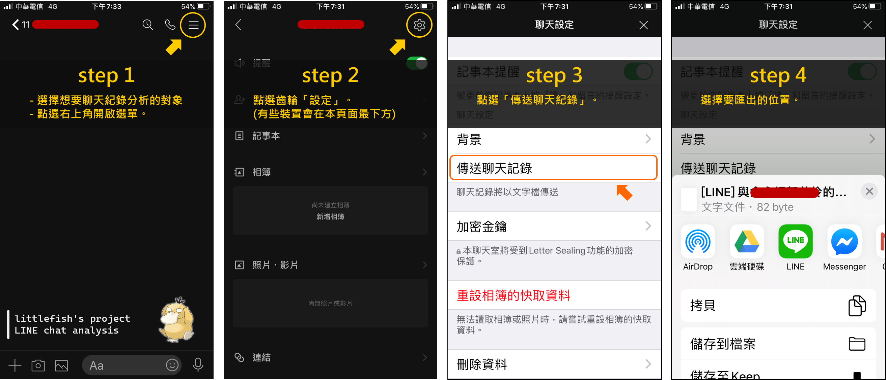

# README

發現LINE現在備分聊天紀錄非常方便，  
所以想樣做一個LINE對話紀錄分析。  

最後更新時間: 2020-05-10

## 專案目標

目前鎖定一對一對話，分析兩者聊天過程的頻率以及互動變化。  
假想以主打情侶市場為主，  
未來再推出多人聊天分析功能。

- 語言: R
- 計畫呈現方式: shiny on TWCC server or github.io
- 假想客群: 一對一、情侶、友達以上曖昧關係者
- 聊天紀錄語系: 以中文分析為主
- device: 目前以電腦操作使用為主

**未來期望:**

- 語言: 改用 python 撰寫
- 計畫呈現方式: 自建網站，並追蹤流量分析(GA)
- 客群: 群組對話分析(這要有甚麼功能要再想一下)
- 聊天紀錄語系: 中文 + 英文
- device: 手機也可使用
- 功能
  - 自訂圖檔標頭
  - 匯出圖檔
  - 顏色模板設定
  - 可否選擇頭像icon

**開發時程紀錄:**

- 2020-05-10: 完成專案初步設計

## 如何匯出LINE的聊天紀錄

因為LINE本身設計的緣故，所以建議要匯出完整的聊天紀錄，請用手機匯出後，再傳入電腦進行本系統操作。  

> - 電腦版LINE匯出只會匯出當前有 loading 的紀錄，如果越往上滑，則會有越多的紀錄可以匯出。  
> - 手機上的LINE選擇備分聊天紀錄時，會直接匯出所有紀錄。

以下介紹手機LINE如何匯出對話紀錄。



step0. 點選想匯出的聊天室  
step1. 點選右上角，開啟選單  
step2. 點選齒輪「設定」。(有些裝置會在此頁面的最下方)  
step3. 點選傳送聊天紀錄。
step4. 選擇要匯出聊天紀錄的位置。

## 網站規劃 - 親愛的你/妳變了嗎?

- 上傳.txt檔案
- 雙人、~~多人~~

## 認識LINE聊天紀錄文字檔

**基本格式:**

每換新的一天會留下一行空白行。  
多個照片一起傳，也會分成一行一張。

[日期: YYYY/MM/DD(weekday)]
[時間: 上午/下午HH:MM]	[LINE名稱]	[對話紀錄]
[時間: 上午/下午HH:MM]	[LINE名稱已收回訊息]

對話紀錄可以為 

- [對話紀錄]
- ["有換行的對話紀錄1]
  - [有換行的對話紀錄2"] ← 這個會單純在下一行，前面不會有訊息。
- [url]
- [[貼圖]]
- [[照片]]
- [[檔案]]
- [[語音訊息]]
- [[相簿] (null)]
- [☎ 通話時間hh:mm:ss]
- [☎ 未接來電]
- [emoji❤️😘🎉👏😆🤣😂😛🌹😍❤😴🥳👋😭😳🥺☹️😚🥰😱😄]

以下為各種格式的簡單例子

```{txt}
  
2019/09/29（日）
上午09:06	大正妹	今天天氣真好
上午09:06	可達鴨	"對阿
想要出去玩嗎"
上午09:07	大正妹	好啊 呱呱呱
上午09:07	可達鴨	OKOK~呱呱呱
上午09:10	可達鴨	[貼圖]
上午09:30	可達鴨	☎ 通話時間20:25
上午09:40	大正妹	[語音訊息]
上午09:40	大正妹	☎ 通話時間0:12
上午10:00	可達鴨	☎ 未接來電
上午11:55	大正妹	[照片]
上午11:56	可達鴨	❤️
上午11:58	大正妹	https://github.com/littlefish0331
上午01:52	可達鴨	[檔案]
上午03:31	可達鴨	[[相簿] (null)]
上午03:31	大正妹已收回訊息
上午03:31	您已收回訊息
上午04:35	大正妹	☎ 通話時間1:04:00
```

## 分析方式、流程、輸出

原始資料為 raw.txt
先整理成一筆為一次訊息，格式為raw.csv [timestamp, user, context, emoji]  
之後的每一筆資料都從這出發。  
PK = all(timestamp + user + context)。

- timestamp: yyyy-mm-ddThh:mm，24hrs制。
- user: 保持資料原本的使用者名稱。
- context:
  - 多行訊息要變回一行，並用\n分隔。(是同一個訊息框，但為多行這樣。)
  - 收回訊息要轉變回正常格式。
- emoji: 表情符號的十六進位表示。

### 流程

- 讀取資料 chat_rawdata
- 匯出標頭
  - 檔案名稱(聊天室名稱): chat_filename
  - 備分時間: chatfilebackuptime
  - 使用者名稱 chat_user
- 資料清理01 chat_tmp01: 補齊\t
  - 正確格式: 時間\t使用者名稱\t內容，但有時候會少掉第二個\t，所以要補上。
  - 收回訊息也會少掉一個\t，要補上。「您已收回訊息」、「You unsent a message.」
- 資料清理02: 把每一天的訊息，放入list中
- 資料清理03: 同一個訊息框的資訊合併
  - 用"抓出index，兩兩index之間的訊息就是要用\n合併的。
  - 將每一天的日期補在最前面。
- 資料清理04: 切開資料by\t，分成 [timestamp, user, context]
- 資料清理05 chat_tmp02: 清理context的\t。正常只會有兩個\t，中間夾著使用者名稱。
  - 兩個以上的\t變成一個\t
  - 句尾的\t移除
  - \t5這種詭異符號移除

---

### dashboard

- 目的: 依照時間順序呈現聊天內容。

就是如同LINE訊息的介面呈現。  
可以選擇想要檢視的時間範圍，  
然後依照自訂或資料預設的使用者名稱，  
依序呈現對話過程。

---

### chat type

資料整理，  
從 raw.csv 變成 [t_date, user, total, video_voice_call_times, voice_message, sticker, others, video_voice_call_length]。  
PK = t_date + user。

- t_date: timestamp，擷取 yyyy-mm-dd
- user: 是誰傳訊息。
- total: 統計當天、該用戶，傳訊息的次數。等於 video_voice_call + voice_message + sticker + others
- video_voice_call_times: 統計當天、該用戶， ☎ 通話時間 的次數
- voice_message: 統計當天、該用戶，語音訊息次數
- sticker: 統計當天、該用戶，傳送貼圖的總次數
- others: 統計當天、該用戶，其他訊息紀錄次數，可能文字、照片、檔案、相簿、收回訊息等等。等於 total - (video_voice_call + voice_message + sticker)
- video_voice_call_length: 當天 ☎ 通話時間 的總時間長度

**calender heatmap:**

- overall
- 目的: 仿造 github activity 功能，了解長時間下來，每天的訊息類型次數。可看出長時間兩者之間聊天模式的轉換。

繪製聊天紀錄時間熱圖，聊天分成三種: 視訊/語音通話(次數與長度)、語音訊息、貼圖。  

- 總對話次數: 統計當天傳訊息的次數，包含視訊/語音聊天、語音訊息、貼圖。就是計算那一天連天記錄有幾個對話框框就對惹~
- 視訊/語音通話次數: 統計當天 ☎ 通話時間 的次數。
- 語音訊息: 統計當天語音訊息次數。因為匯出的訊息無法取得語音訊息的長度，所以以次數計算。
- 貼圖: 考慮到情侶之間會用貼圖聊天XD~統計當天傳送貼圖的總次數。
- 視訊/語音通話時間: 統計當天 ☎ 通話時間 的總長度。

**chat type analysis:**

- overall, split
- 目的: 了解短時間(特定時間範圍下)，兩者之間的聊天模式。可看出彼此之間習慣怎樣的溝通方式，個別與整體一起比較。

選定一段時間之後，最小單位為天。  
統計時間範圍內的 總對話次數、視訊/語音通話、語音訊息、貼圖。  
繪製 長條圖、圓餅圖、固定長度長條圖。

- 長條圖: [x, y] = [總對話次數、視訊/語音通話、語音訊息、貼圖, 次數]，可interactive隱藏。
- 圓餅圖: 總對話次數、視訊/語音通話、語音訊息、貼圖，站這段時間的比例
- 固定長度長條圖比例: 在固定長度下的長條圖中，顯示兩者在此 chat type 下的使用比例。
  - 也可以用 pyramid chart，但是就看不出比例。

**chat type animation-bar:**

- 目的: 動態顯示聊天模式轉變過程。

選定一段時間之後，長度至少一周，最小單位為一天。  
繪製 animation-bar，可分成整體一起看，或是兩者分開來看。

---

### word cloud and word count

資料整理，  
排除 url、[貼圖]、[照片]、[檔案]、[語音訊息]、[相簿] (null)、☎ 通話時間hh:mm:ss、☎ 未接來電。  
從 raw.csv 變成 [t_date, user, segword]。  
PK = all(t_date + user + segword)。

- t_date: timestamp，擷取 yyyy-mm-dd
- user: 是誰傳訊息。
- segword: 斷詞結果，表情符號要單獨斷出來。

資料處理上，因為這是聊天紀錄，而非一般文章，  
所以會出現用表情符號來傳達訊息的情況，  
因此建議在分析上，需要加入一些自訂的字典輔助，不建議使用預設的停止詞庫
自訂的字典包括:

- 表情符號圖庫、火星文: 用於斷詞(<3、XD)。
- 一般標點符號: 刪去停止詞。
- 自定義詞庫
- 自定義停止詞

**文字雲:**

- overall, split
- 目的: 顯示聊天紀錄，斷詞後的詞頻，以文字雲呈現。

選定一段時間之後，長度至少一周，最小單位為一天。  

- 可選擇要填入的圖形外框: 可以先給幾個特定模板。
- 整體、兩者分開。
- 是否使用表情符號。

**詞頻:**

- overall, split
- 目的: 顯示聊天紀錄，斷詞後的詞頻，以長條圖呈現。

選定一段時間之後，長度至少一周，最小單位為一天。  

- 整體、兩者分開。
- 非表情符號。
  - 可選擇詞的字數，最少二字。
  - 多到少排序。
- 表情符號。
  - 多到少。

---

### chat blockN and wordN

資料整理，考慮特殊行為(標點符號、表情符號、貼圖、照片等)的意義，  
僅轉換 url為[網址]，其餘保留。  
從 raw.csv 變成 [t_date, user, blockN, wordN, video_voice_call_length]。
PK = t_date + user

- t_date: timestamp，擷取 yyyy-mm-dd
- user: 是誰傳訊息。
- blockN: 統計當天、該用戶，訊息次數。
- wordN: 統計當天、該用戶，字數。
- video_voice_call_length: 統計當天、該用戶，視訊/語音聊天時間長度

**隨時間，訊息次數、字數、平均句子中的字數之變化:**

- overall, split
- 目的: 了解隨時間變化下，彼此文字聊天模式的變化

選定一段時間之後，長度至少一周，最小單位為一天。  

- 整體、兩者分開。
- 折線圖: [x, y1, y2, y3] = [時間, 訊息次數, 字數, 字數/訊息次數]

**泡泡圖 - 訊息次數、字數:**

- overall
- 目的: 了解溝通模式(文字聊天與視訊/語音聊天)，隨時間的變化，進一步了解兩人關係轉變前後，文字聊天的實質變化。因為這兩者是LINE主要的溝通方式(語音訊息只是留言而已)。

選定一段時間之後，長度至少一周，最小單位為一天。  

- 做成泡泡圖動畫
- [x, y, r] = [訊息次數, 字數, 視訊/語音聊天時間長度]

---

### 有趣的分析 - 疊字

疊字很容易被被斷詞斷開，或是被當作停止詞，  
所以額外拉出處理。

資料整理，從 raw.csv 變成 [t_date, user, doubleword]。  
每去掃過一遍 ABCDDEA，則rle(Run Length Encoding)=1,1,1,2,1,1，  
則去找頻率有超過2的字詞。  
PK = all(t_date + user + doubleword)。

- t_date: timestamp，擷取 yyyy-mm-dd
- user: 是誰傳訊息。
- doubleword: 疊字。

順便製作疊字字典。

**最愛使用的疊字:**

- overall, split
- 目的: 該時間範圍下，喜好使用的疊字。

選定一段時間之後，長度至少一周，最小單位為一天。  

- 整體、兩者分開。
- 文字雲
  - 可自訂形狀
- 長條圖
  - 由多到少排序

---

### 有趣的分析 - 對話情緒

給予每次訊息，一個平均情緒分數。  
視覺化隨時間的情緒變化。  
時間單位的細緻度為minm

資料整理，  
從 raw.csv 變成 [timestamp_min, user, content_combine]。  
PK = timestamp_min + user

- timestamp_min: yyyy-mm-ddThh:mm。GROUPBY到min。
- user: 是誰傳訊息。
- content_combine: GROUPBY(timestamp)到min，把content用空白paste起來。

再整理成 [timestamp_min, user, emotion_score, es_happy, es_sad, es_angry, ...]。  
預設 emotion_score = 0，  
而一次訊息裡面可能有很多句，將每句斷開作判斷後，加總平均，作為這次訊息的 emotion_score。  
PK = timestamp_min + user

- timestamp_min: yyyy-mm-ddThh:mm。上一步有做GROUPBY到min。
- user: 是誰傳訊息。
- emotion_score: 計算時間下，該用戶，訊息(content_combine)的情緒分數(正向負向)。
- es_happy, ....: 各種情緒面向的分數。應該加總要為 emotion_score。

**對話情緒變化:**

- overall, split
- 目的: 該時間範圍下，聊天的情緒變化。

選定一段時間之後，長度至少一周，最小單位為一天。  

- 整體、兩者分開。
- 折線圖: [x, y] = [timestamp_min, emotion_score]

**對話情緒雷達圖:**

- overall, split
- 目的: 該時間範圍下，聊天的情緒，各種面向分布。

選定一段時間之後，長度至少一周，最小單位為一天。  

- 整體、兩者分開。
- 雷達圖: [x1, x2, ..., y1, y2, ...] = ["happy", ...,  es_happy, ...]

---

### 有趣的分析 - chat timeline

資料整理，  
從 raw.csv 變成 [timestamp, user, content, duration = (0, 通話時間長度)]。  
再 GROUPBY(timestamp, user, duration)到min，  
整理成 [timestamp_min, user, start = timestamp_min - duration, end = timestamp]。  
PK = user + start + end

- timestamp_min: yyyy-mm-ddThh:mm。GROUPBY到min。
- user: 是誰傳訊息。
- start: 訊息開始時間。
- end: 訊息結束時間。(只有 視訊/語音聊天 時，start, end 不相同。)

**依照時間順序呈現聊天次序與長度:**

- split
- 目的: 該時間範圍下，依照時間順序，呈現聊天次序與長度。可看到聊天是誰主動，以及持續長度。
- 繪圖關鍵字: R timeline, vistime

選定一段時間之後，長度至少一天，最小單位為一天。  

- 兩者分開但繪製在一個timeline中。
- timeline: [group = user, start, ene]

輸出timeline，事件持續時間=0，則為一點，若事件持續時間>0，則為長條。  
所以會有四列，[userA 傳訊息, userA 視訊通話, userB 傳訊息, userB 視訊通話]

---

### 有趣的分析 - chat block analysis

資料整理，思考同一個使用者所發的連續訊息，為一個單位，  
從 raw.csv，先新增欄位 rle_user: 也就是上述單位的編號，  
GROUPBY(編號, user)，變成 [user_rle, user, start, end, diff_user_rle, activeTF, duration, video_voice_call_length, content_combine_nchar]  
PK = user_rle

- user_rle: 連續區塊的編號。
- user: 是誰傳訊息。
- start: 如果連續區塊第一個訊息為視訊/語音聊天，第一筆時間為 timestamp-duration，否則就為第一筆的時間
- end: 連續區塊的結束時間。
- diff_user_rle: 和上一個連續編號的訊息相隔時間，即 目前start - 上一個end。單位秒。
- activeTF: 用時間間隔(10mins)判斷是否為主動方
- duration: 統計該連續區塊持續時間。單位秒。如果是0，改為1/3*content_combine_nchar。
- video_voice_call_length: 統計該連續區塊所包含的通話時間，  
- content_combine_nchar: 該連續區塊的字數總和。

整理後資料欄位需求與樣貌:  

| user_rle | user | start | end | video_voice_call_length | diff_user_rle | duration |
|---|---|---|---|---|---|---|
|1|A|2020-03-31T08:00|2020-03-31T08:30|20|25|30|
|2|B|2020-03-31T08:30|2020-03-30T08:30|0|0|0|

**daily, who speak first:**

- overall, split
- 目的: 統計每天主動次數。

選定一段時間之後，長度至少一周，最小單位為一天。  

- GROUPBY(start的yyyy-mm-dd)，sum(主動次數)。
- 兩者分開但繪製在一個圖中。
- 折線圖: [x, y] = [timestamp = start, daily_active_times]。理論上應該用長條圖。
- 新增 daily_active_times_ratio = userA/userB
  - 可調整 userA/userB，或是 userB/userA

**daily, who speak more time:**

- overall, split
- 目的: 統計每天聊天花費時間。

選定一段時間之後，長度至少一周，最小單位為一天。  

- GROUPBY(start的yyyy-mm-dd)，sum(聊天花費時間+通話時間)。
- 兩者分開但繪製在一個圖中。
- 折線圖: [x, y] = [timestamp = start, daily_length]。理論上應該用長條圖。
- 新增 daily_length_total = userA + userB

**daily, speak interactive times:**

- overall
- 目的: 訊息來回交流的次數。

選定一段時間之後，長度至少一周，最小單位為一天。  

- GROUPBY(start的yyyy-mm-dd)，nrow。
- 折線圖: [x, y] = [timestamp = start, daily_interactive_times]。理論上應該用長條圖。

**daily, chat block 泡泡圖:**

- overall
- 目的: 分析每天訊息交流的層面，包括總時間、互動次數、主動被動。用 speak time, interactive time, daily_active_times_ratio

選定一段時間之後，長度至少一周，最小單位為一天。

- GROUPBY(start的yyyy-mm-dd)。
- animation bubble plot: [x, y, r] = [speak time, interactive time, daily_active_times_ratio]
  - daily_active_times_ratio 可調整 userA/userB，或是 userB/userA

---

### 有趣的分析 - 詞語sankey圖

資料整理，思考同一個使用者所發的連續訊息，為一個單位，  
把每個連續訊息的關鍵字找出，用空白paste起來，
統計自己關鍵字引發關鍵字的組合，  
統計userA關鍵字引發userB關鍵字的組合。

從 raw.csv，先新增欄位 rle_user: 也就是上述單位的編號，  
GROUPBY(編號, user)，變成 [user_rle, timestamp_begin, user, content_combine]，  
斷詞 [user_rle, timestamp_begin, user, segwords]，  
PK = user_rle

- user_rle: 連續區塊的編號。
- timestamp_begin: 連續區塊的開始時間。
- user: 是誰傳訊息。
- content_combine: 連續區塊的所有訊息。
- segwords: 斷詞結果用空白相連。

之後再轉換成

- [user_rle, timestamp_begin, user, segword_from, segword_to]，自己關鍵字引發關鍵字的組合。
- [user_rle, timestamp_begin, user, segword_from, segword_to]，userA關鍵字引發userB關鍵字的組合。

注意關鍵字

- 納入疊字字典。
- 可為主詞(實體)、動詞。

**喜愛用詞組合:**

- 目的: 想知道該使用者各自喜好的用詞組合。

選定一段時間之後，長度至少一周，最小單位為一天。

- sankey: 一層userA，一層關鍵詞(from)，一層關鍵詞(to)

**我拋你接詞語:**

- 目的: 想知道聊天彼此的詞常用關鍵字互動。

選定一段時間之後，長度至少一周，最小單位為一天。

- sankey: 一層userA，一層關鍵詞(from)，一層關鍵詞(to)，一層userB。(反過來解讀就是from, to對調)。

---

### 綜合分析

要先統計每日聊天紀錄的以下資訊:

- 聊天時間
- 交流來回次數
- 聊天字數
- 貼圖次數
- 通話時間，無通話為NA。(如果是0，後續處理要先排除0)
- 語音訊息次數，無語音訊息為NA。(如果是0，後續處理要先排除0)
- 平均回應時間
- 主動被動比例: 計算選定一種方向userA/userB。數值要表示是否聊天開啟都是偏頗某一方。健康一點應該要接近1。

為做到這件事，資料整理，思考同一個使用者所發的連續訊息，為一個單位，  
把每個連續訊息的關鍵字找出，用空白paste起來，
從 raw.csv，先新增欄位 rle_user: 也就是上述單位的編號，  
GROUPBY(編號, user)，變成 [user_rle, user, start, end, diff_user_rle, activeTF, duration, video_voice_call_length, sticker_times, voice_message_times, content_combine_nchar]  
PK = user_rle(+user)

- user_rle: 連續區塊的編號。
- user: 是誰傳訊息。
- start: 如果連續區塊第一個訊息為視訊/語音聊天，第一筆時間為 timestamp-duration，否則就為第一筆的時間
- end: 連續區塊的結束時間。
- diff_user_rle: 和上一個連續編號的訊息相隔時間，即 目前start - 上一個end。單位秒。
- activeTF: 用時間間隔(10mins)判斷是否為主動方
- duration: 統計該連續區塊持續時間。單位秒。如果是0，改為1/3*content_combine_nchar。
- video_voice_call_length: 統計該連續區塊所包含的通話時間。
- sticker_times: 貼圖次數。
- voice_message_times: 語音訊息時間。
- content_combine_nchar: 該連續區塊的字數總和。

接著GROUPBY(start: yyyy-mm-dd)，得到每日的資訊，  
變成 [t_date, chat_duration, interactive_times, chat_nchar, sticker_times, call_duration, voice_message_times, chat_interval_dailymean, active_passtive_score]

- t_date: yyyy-mm-dd
- chat_duration: 統計當天聊天時間
- interactive_times: 統計當天交流來回次數
- chat_nchar: 統計當天聊天字數
- sticker_times: 統計當天貼圖次數
- call_duration: 統計當天通話時間
- voice_message_times: 統計當天語音訊息次數
- chat_interval_dailymean: 統計當天平均回應時間
- active_passtive_score: 統計當天主動被動比例分數。

**匹配指數:**

- 目的: 隨便的一個標準，認定這對情侶像是哪一種類型的動物。

選定一段時間之後，長度至少一周，最小單位為一天。  
統計上述所有指標的平均。  
各種可愛動物圖片/GIF，加一些文字敘述:

- 七個指標，各有一個門檻，分成兩類，共2^7=128。
- 考慮動物: 大象、貓咪、狗狗、小鳥、長頸鹿、獅子、海獺、貓系、犬系
  - [【情人節心理測驗】：誰才是最適合你的動物系男友？](https://www.elle.com/tw/lovelife/horoscopes/g26130231/animal-boyfriend/)
- show 七個指標數值的雷達圖。
